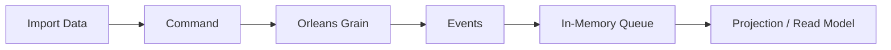

# Company Directory Sample

This solution is a sample project that demonstrates a modern event-sourced architecture using **.NET 9** and **Orleans**. It is designed for scenarios where data is imported in an append-only fashion: every import provides the full set of records, and there is no direct indication of which records have changed.

## Key Architectural Concepts

### 1. Append-Only Import Data
- The system receives the entire dataset on each import.
- There is no delta or change tracking in the import; all records are always present.
- The system must process the full set and determine the resulting state based solely on the events generated.

### 2. Commands and Events
- **Commands** represent user or system intentions (e.g., `ImportCompanyRequest`, `DeleteCompanyRequest`).
- When a command is processed, it emits one or more **events** (e.g., `CompanyCreated`).
- Events are the only source of truth for state changes. The current state is always derived from the event stream.

### 3. Event Sourcing
- The state of each entity (such as a company) is not stored directly.
- Instead, the state is reconstructed by replaying all events for that entity.
- This provides a complete audit trail and enables rebuilding state at any point in time.

### 4. Orleans Grains
- The solution uses [Orleans](https://dotnet.github.io/orleans/) grains to encapsulate logic and state for each entity.
- Each grain processes commands, emits events, and manages state reconstruction from its event stream.
- Orleans provides distributed, scalable, and reliable state management.

### 5. In-Memory Queue for Projections
- As events are emitted, they are placed on an in-memory queue (`IProjectionBuilderQueue`).
- This queue is used to build and update **projections** (read models) that support efficient queries.
- Projections can be rebuilt at any time by replaying events from the queue, ensuring eventual consistency.

## Architectural Flow

1. **Import Data**: The system receives the full dataset.
2. **Command**: An import command is issued for each record.
3. **Orleans Grain**: The grain processes the command and emits events.
4. **Event**: Events are persisted and represent the source of truth.
5. **In-Memory Queue**: Events are queued for projection building.
6. **Projection / Read Model**: Projections are updated for fast, queryable state.

## Benefits
- **Scalability**: Orleans grains enable distributed and scalable state management.
- **Auditability**: Every change is event-driven, providing a complete and immutable audit trail.
- **Flexibility**: Projections can be rebuilt or extended at any time by replaying the event stream.
- **Simplicity**: The append-only import model simplifies integration with external data sources.

## When to Use This Approach
- When you always receive the full dataset and cannot rely on change tracking.
- When you need a robust audit trail and the ability to reconstruct state at any point.
- When you want to leverage the scalability and reliability of Orleans for distributed systems.

---

This solution is ideal for modern distributed systems that require strong consistency, auditability, and flexibility in handling large-scale, append-only data imports.
